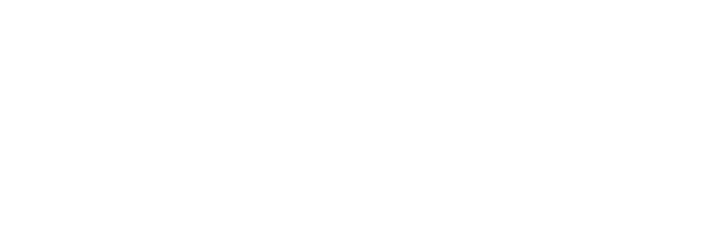

<!-- Improved compatibility of back to top link: See: https://github.com/othneildrew/Best-README-Template/pull/73 -->
<a name="readme-top"></a>
<!--
*** Thanks for checking out the Best-README-Template. If you have a suggestion
*** that would make this better, please fork the repo and create a pull request
*** or simply open an issue with the tag "enhancement".
*** Don't forget to give the project a star!
*** Thanks again! Now go create something AMAZING! :D
-->


<!-- PROJECT SHIELDS -->
<!--
*** I'm using markdown "reference style" links for readability.
*** Reference links are enclosed in brackets [ ] instead of parentheses ( ).
*** See the bottom of this document for the declaration of the reference variables
*** for contributors-url, forks-url, etc. This is an optional, concise syntax you may use.
*** https://www.markdownguide.org/basic-syntax/#reference-style-links
-->
<!-- PROJECT LOGO -->
<br />
<div align="center">
  <a href="https://github.com/2022-csc-59866/AthleteLink">
    
  </a>

<h3 align="center">Athlete Link</h3>

  <p align="center">
      
    Introducing Athlete Link, the ultimate platform for fitness enthusiasts and athletes to connect, train, and reach their fitness goals together. With our innovative and user-friendly     interface, finding the perfect training partner has never been easier.
    
      Swipe, match, and connect! Athlete Link offers a seamless and engaging experience similar to popular dating apps. Browse through a diverse community of fitness enthusiasts in your area, and with a simple swipe, indicate your interest in their profile. Whether you're looking for a workout buddy, a running partner, a yoga companion, or someone to hit the weights with, Athlete Link is here to help you find your ideal training match.

      But it doesn't stop there! Once you've found a match, our real-time chat feature allows you to connect instantly and start planning your training sessions. Coordinate schedules, exchange fitness tips, and motivate each other towards success. Athlete Link creates a supportive and dynamic environment where you can build meaningful connections with like-minded individuals who share your passion for fitness.

      Looking for a gym to train at? We've got you covered. Athlete Link provides a comprehensive gym-finder feature that enables you to locate nearby fitness facilities tailored to your preferences. Whether you prefer a traditional gym, a specialized studio, or outdoor training spaces, our app will guide you to the perfect location that meets your specific needs.

      Key Features:

      Swipe and Match: Explore user profiles and indicate your interest with a simple swipe.
      Real-time Chat: Connect with your training partner and plan workouts in a seamless messaging interface.
      Gym Finder: Discover nearby gyms and fitness facilities based on your preferences.
      Profile Customization: Showcase your fitness journey, interests, and goals through a personalized profile.
      Privacy and Safety: We prioritize the privacy and safety of our users, ensuring a secure and enjoyable experience.
      Join the thriving fitness community on Athlete Link and unlock a world of training opportunities. Whether you're a beginner taking your first steps towards a healthier lifestyle or a seasoned athlete looking for new challenges, our app is designed to empower you on your fitness journey. Download Athlete Link now and let's get ready to train together!
    <br />

    <br />
  
  </p>
</div>

<br/>
  <a href="https://github.com/2022-csc-59866/AthleteLink">View Demo</a>
<br/>
  <a href="https://github.com/2022-csc-59866/AthleteLink/issues">Report Bug</a>
<br/>
  <a href="https://github.com/2022-csc-59866/AthleteLink/issues">Request Feature</a>

<br/>

<!-- TABLE OF CONTENTS -->
<details>
  <summary>Table of Contents</summary>
  <ol>
    <li>
      <a href="#about-the-project">About The Project</a>
      <ul>
        <li><a href="#built-with">Built With</a></li>
      </ul>
    </li>
    <li> <a href="#getting-started">Getting Started</a> </li>
    <li><a href="#prerequisites">Prerequisites</a></li>       
    <li><a href="#installation">Installation</a></li>
    </li>
    <li><a href="#usage">Usage</a></li>
    <li><a href="#roadmap">Roadmap</a></li>
    <li><a href="#contributing">Contributing</a></li>
    <li><a href="#license">License</a></li>
    <li><a href="#contact">Contact</a></li>
    <li><a href="#acknowledgments">Acknowledgments</a></li>
  </ol>
</details>


<!-- ABOUT THE PROJECT -->
## About The Project

[![Product Name Screen Shot][product-screenshot]](https://example.com)

Here's a blank template to get started: To avoid retyping too much info. Do a search and replace with your text editor for the following: `github_username`, `repo_name`, `twitter_handle`, `linkedin_username`, `email_client`, `email`, `project_title`, `project_description`

<p align="right">(<a href="#readme-top">back to top</a>)</p>


### Built With

* [![React][React.js]][React-url]
  <li>Firebase </li>
  <li>Express JS </li>
  <li>Node JS </li>

<p align="right">(<a href="#readme-top">back to top</a>)</p>


<!-- GETTING STARTED -->
## Getting Started

This is an example of how you may give instructions on setting up your project locally.
To get a local copy up and running follow these simple example steps.

### Prerequisites

This is an example of how to list things you need to use the software and how to install them.
* npm
  ```sh
  npm install npm@latest -g
  ```

### Installation

1. Get a free API Key at [Google Developers Api Explorer ](https://developers.google.com/apis-explorer)
2. Clone the repo
   ```
   git clone https://github.com/2022-csc-59866/AthleteLink.git
   ```
3. Install NPM packages
   ```
   npm install
   ```
4. Enter your Firebase Configurations in `api/server/config.js`
   ```
   Update admin.initializeApp({}) with firebase configuration
   ```
5. Enter your Firebase Configurations in `src/firebase.js`
   ```
   Update firebaseConfig with your own apiKey.
   ```
6. Run the Backend Server `cd api/server`
   ```
   npm run start
   ```
7. Run fronend client `main directiory`
   ```
   npm run start
   ```


<p align="right">(<a href="#readme-top">back to top</a>)</p>


<!-- USAGE EXAMPLES -->
## Usage

Use this space to show useful examples of how a project can be used. Additional screenshots, code examples and demos work well in this space. You may also link to more resources.

_For more examples, please refer to the [Documentation](https://example.com)_

<p align="right">(<a href="#readme-top">back to top</a>)</p>


<!-- ROADMAP -->
## Roadmap

**Key Features:**

- **Swipe and Match:** Explore user profiles and indicate your interest with a simple swipe.
- **Real-time Chat:** Connect with your training partner and plan workouts in a seamless messaging interface.
- **Gym Finder:** Discover nearby gyms and fitness facilities based on your preferences.
- **Profile Customization:** Showcase your fitness journey, interests, and goals through a personalized profile.
- **Privacy and Safety:** We prioritize the privacy and safety of our users, ensuring a secure and enjoyable experience.

See the [open issues](https://github.com/github_username/repo_name/issues) for a full list of proposed features (and known issues).

<p align="right">(<a href="#readme-top">back to top</a>)</p>


<!-- CONTRIBUTING -->
## Contributing

Contributions are what make the open source community such an amazing place to learn, inspire, and create. Any contributions you make are **greatly appreciated**.

If you have a suggestion that would make this better, please fork the repo and create a pull request. You can also simply open an issue with the tag "enhancement".
Don't forget to give the project a star! Thanks again!

1. Fork the Project
2. Create your Feature Branch (`git checkout -b feature/AmazingFeature`)
3. Commit your Changes (`git commit -m 'Add some AmazingFeature'`)
4. Push to the Branch (`git push origin feature/AmazingFeature`)
5. Open a Pull Request

<p align="right">(<a href="#readme-top">back to top</a>)</p>


<!-- LICENSE -->
## License

Distributed under the MIT License. See `LICENSE.txt` for more information.

<p align="right">(<a href="#readme-top">back to top</a>)</p>


<!-- CONTACT -->
## Contact

Your Name - [@twitter_handle](https://twitter.com/twitter_handle) - email@email_client.com

Project Link: [https://github.com/github_username/repo_name](https://github.com/github_username/repo_name)

<p align="right">(<a href="#readme-top">back to top</a>)</p>


<!-- ACKNOWLEDGMENTS -->
## Acknowledgments

* []()
* []()
* []()

<p align="right">(<a href="#readme-top">back to top</a>)</p>


<!-- MARKDOWN LINKS & IMAGES -->
<!-- https://www.markdownguide.org/basic-syntax/#reference-style-links -->
[contributors-shield]: https://img.shields.io/github/contributors/github_username/repo_name.svg?style=for-the-badge
[contributors-url]: https://github.com/github_username/repo_name/graphs/contributors
[forks-shield]: https://img.shields.io/github/forks/github_username/repo_name.svg?style=for-the-badge
[forks-url]: https://github.com/github_username/repo_name/network/members
[stars-shield]: https://img.shields.io/github/stars/github_username/repo_name.svg?style=for-the-badge
[stars-url]: https://github.com/github_username/repo_name/stargazers
[issues-shield]: https://img.shields.io/github/issues/github_username/repo_name.svg?style=for-the-badge
[issues-url]: https://github.com/github_username/repo_name/issues
[license-shield]: https://img.shields.io/github/license/github_username/repo_name.svg?style=for-the-badge
[license-url]: https://github.com/github_username/repo_name/blob/master/LICENSE.txt
[linkedin-shield]: https://img.shields.io/badge/-LinkedIn-black.svg?style=for-the-badge&logo=linkedin&colorB=555
[linkedin-url]: https://linkedin.com/in/linkedin_username
[product-screenshot]: images/screenshot.png
[Next.js]: https://img.shields.io/badge/next.js-000000?style=for-the-badge&logo=nextdotjs&logoColor=white
[Next-url]: https://nextjs.org/
[React.js]: https://img.shields.io/badge/React-20232A?style=for-the-badge&logo=react&logoColor=61DAFB
[React-url]: https://reactjs.org/
[Vue.js]: https://img.shields.io/badge/Vue.js-35495E?style=for-the-badge&logo=vuedotjs&logoColor=4FC08D
[Vue-url]: https://vuejs.org/
[Angular.io]: https://img.shields.io/badge/Angular-DD0031?style=for-the-badge&logo=angular&logoColor=white
[Angular-url]: https://angular.io/
[Svelte.dev]: https://img.shields.io/badge/Svelte-4A4A55?style=for-the-badge&logo=svelte&logoColor=FF3E00
[Svelte-url]: https://svelte.dev/
[Laravel.com]: https://img.shields.io/badge/Laravel-FF2D20?style=for-the-badge&logo=laravel&logoColor=white
[Laravel-url]: https://laravel.com
[Bootstrap.com]: https://img.shields.io/badge/Bootstrap-563D7C?style=for-the-badge&logo=bootstrap&logoColor=white
[Bootstrap-url]: https://getbootstrap.com
[JQuery.com]: https://img.shields.io/badge/jQuery-0769AD?style=for-the-badge&logo=jquery&logoColor=white
[JQuery-url]: https://jquery.com 
